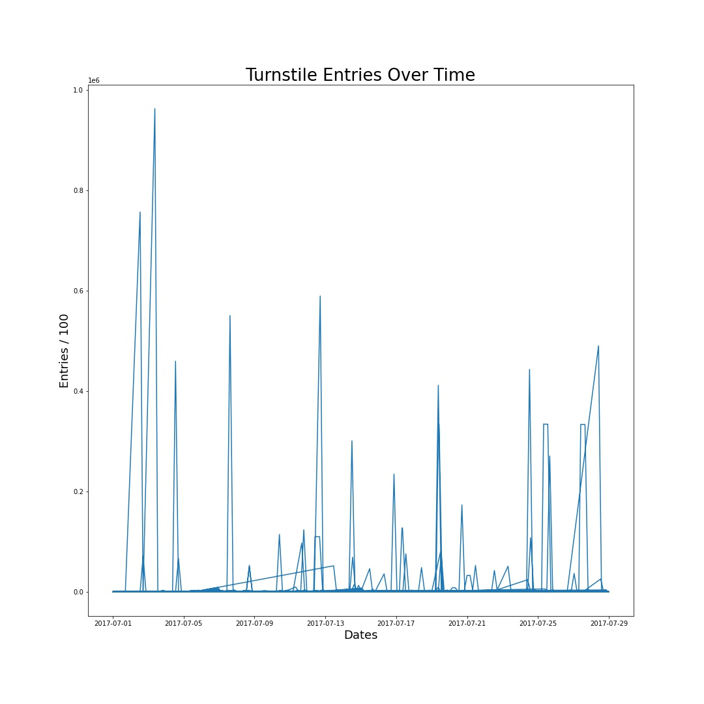

# MTA_track_maintainance_EDA

This project will look into the mta turnstile data of the summer of hell period in july 2017 and recent 2021 data in order to **choose when to shutdown for maintainance**

in efforts to choose the right time for maintainance this plot shows there are times where the entries are extremely low, this could be our solution.
